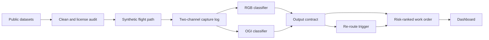

# Technical Requirements Document (TRD)
# Autonomous Drone Pipeline Inspection — Feasibility PoC
### *Companion to `PRD.md` — derived from `Pipeline_Integrity_Timeline.xlsx`*

## Document Control

| Field | Value |
|---|---|
| **Project** | Autonomous Drone Pipeline Inspection PoC ("Pipeline Integrity Pilot") — Deloitte Energy & Chemicals |
| **Companion doc** | `PRD.md` — product framing, stakeholders, timeline, risks |
| **Source material** | `Pipeline_Integrity_Timeline.xlsx` |
| **Scope of this document** | System architecture, data specifications, model specs, interfaces, and non-functional requirements needed to build the PoC |
| **Status** | **Rev. 2** — revised Sept 3, 2026 following an architecture/requirements review; changes marked **[Rev. 2]** inline, on top of the existing **[Recommended]** convention for proposals not present in the source plan. Dataset facts in §3 were independently re-verified against primary sources on Sept 2, 2026, in addition to the source workbook's own Sept 2026 verification pass. See `Review_Memo.md` for the initial (Rev. 1) architecture and the full rationale behind each Rev. 2 change. |

---

## 1. Architecture Overview

The four workstreams map directly onto the use case's own Sense → Reason → Act → Adapt loop:

| Loop stage | Track | Owner | System layer |
|---|---|---|---|
| Sense | Sensing & Simulation | Anshuman | Data + Simulation |
| Reason | Anomaly Detection Model | Shashwat | Model |
| Act | Flight Planning & Work Orders | Anshuman | Orchestration |
| Adapt | Integration, Dashboard & Demo | Shashwat | Integration + Reporting |



End-to-end data flow: public datasets → cleaning/license audit → synthetic flight-path generator → mock two-channel drone capture log → [RGB classifier | OGI classifier] → shared output contract (§5) → flight re-route trigger + risk-ranked work order (§9) → dashboard view (§10).

> **[Rev. 2] "Adapt" is a label, not a loop.** As specified, nothing downstream of the dashboard feeds back into Sense — there's no retraining trigger and no patrol-strategy adjustment. The four-stage name is inherited from the use case's own framing; the PoC implements Sense→Reason→Act→**Report**. Fine for a PoC, but FR-2.4 (PRD) now asks Track 4 to say this explicitly in its Week 7 write-up rather than let "Adapt" imply more than what's built.

## 2. Environment & Tooling

| Item | Spec | Source |
|---|---|---|
| Training compute | Google Colab; no local GPU assumed | Source plan |
| Shared tooling | Repo + dependency environment set up in Week 1, shared across both modalities | Source plan |
| Language/framework | Python; CNN transfer learning implies a framework such as PyTorch or TensorFlow | **[Recommended]** — not named in source |
| Version control | Git repository | **[Recommended]** — implied by "repo" in the Week 1 task, not spelled out |
| Notebook layout | One Colab notebook per track/classifier, sharing a common `data/` and `interfaces/` module | **[Recommended]** |

## 3. Data Sources & Specifications

All datasets below were verified by the source-plan authors (source-by-source, Sept 2026) **and independently re-checked against primary sources for this TRD** (papers, GitHub repos, dataset pages). Two discrepancies surfaced during that re-check — flagged inline and summarized in §3.4.

### 3.1 RGB Corrosion Imagery

| Dataset | Nature | Size | License / access | Link |
|---|---|---|---|---|
| Kaggle "Pipeline Corrosion Dataset" (aditya068) | Real photos of normal/corroded pipelines | 384.69 MB (confirmed) | **License field reads "Not specified" on the Kaggle page — treat as unresolved, see §15** | `kaggle.com/datasets/aditya068/pipeline-corrosion-dataset` |
| K-Pipelines (Ramos et al., *Intelligent Systems with Applications*, Elsevier) | Peer-reviewed, Stable-Diffusion-synthetic | 600 base images / 1,080 in the augmented version (confirmed) | GPL-3.0 (copyleft) | `github.com/leoxthomas/K-Pipelines` — pip-installable: `pip install git+https://github.com/leoxthomas/K-Pipelines` |
| Scraped GitHub corrosion set | Real, scraped from Google Images across 8 corrosion categories | Repo states **1,819** labeled images (CORROSION + NO CORROSION combined) — **see discrepancy note §3.4** | Noisy labels — needs cleaning (Week 2) | `github.com/pjsun2012/Phase5_Capstone-Project` |

> **[Rev. 2] Taxonomy note:** the scraped set's 8 corrosion categories create a real ambiguity the source plan doesn't resolve — is the RGB classifier binary or 8-class? OGI is explicitly binary (§7.2); RGB was left open. **Recommended default:** binary (`corrosion`/`no_corrosion`) for the Week 3 MVP, folding the 8 categories together; treat multi-class as a stretch extension once the binary baseline meets its floor (§7.4). This needs a decision before Week 3, the same way the output contract (§5) does — see PRD §6, assumption 8.

### 3.2 OGI / Methane Leak Imagery

| Dataset | Nature | Size | License / access | Link |
|---|---|---|---|---|
| GasVid (Wang et al., Stanford Natural Gas Initiative, METEC controlled releases, July 2017) | Real IR video, FLIR GF-320 camera, 31 videos × 24 min | Originating paper states **~669,600 frames**; several later papers cite "~1M" — **see discrepancy note §3.4** | Per source papers | Published via the VideoGasNet/GasNet paper family (no single canonical repo link recorded) |
| Gas-DB / RT-CAN | Real RGB-thermal pairs, 8 scene types (sunny, rainy, near/far leakage, overlook, simple/complex background) | 1,293 images (confirmed, ~1.3K) | Per source paper; data hosted via Google Drive/OneDrive links inside the repo, not bundled directly | `github.com/logic112358/RT-CAN` |
| GasSeg | Real-world infrared gas segmentation, largest of the three | 6,426 images / 7,390 segmentation targets (confirmed) | **Training data on request only — confirmed, not direct download** | `github.com/FisherYuuri/GasSeg` |

### 3.3 Optional / Out of Scope

| Dataset | Modality | Status |
|---|---|---|
| GPLA-12 (Deep-AI-Application-DAIP) | Acoustic emission | Confirmed: 684 samples across 12 categories, lab-bench-scale, now on its third data revision (`data_v1`/`data_v2`/current). **Optional bonus module only** — inclusion decided at Checkpoint 1. Links: `github.com/Deep-AI-Application-DAIP/acoustic-leakage-dataset-GPLA-12`, `daip.club` |
| — none identified — | LiDAR ground-movement/encroachment | **Out of scope** — confirmed no public dataset exists |

*(Aside: the source plan's comparison to "the IIG dataset" for access friction likely refers to the same GasSeg author's separate Industrial Invisible Gas dataset — not itself a candidate source for this PoC, just a data point on access difficulty.)*

### 3.4 Discrepancies Found During Independent Verification

Both worth resolving before locking Week 2–4 effort estimates — neither invalidates the plan, but both affect sizing assumptions:

1. **Scraped RGB corrosion set:** the source plan estimates ~4,000 images; the repository's own description states 1,819 labeled images (corrosion + no-corrosion combined). Recommend pulling the current repo contents directly in Week 1 to get an exact count before scoping the Week 2 cleaning pass.
2. **GasVid frame count:** the source plan's Overview tab notes a correction from "~700K" to "~1 million" frames. Independent re-verification found the opposite may be true: the originating VideoGasNet paper (Wang et al.) states **~669,600 frames** — a figure that reconciles exactly with its own stated parameters (31 videos × 24 min × 15 fps = 669,600). Several *later* papers that reuse GasVid instead cite "~1M" or "over a million," which appears to be citation drift rather than a corrected figure. Recommend verifying frame count directly from the dataset files in Week 1 rather than hardcoding either number.

## 4. Data Pipeline Requirements

| ID | Requirement | Week |
|---|---|---|
| TR-4.1 | License audit across every dataset actually used (K-Pipelines GPL-3.0 obligations, Kaggle's unspecified license flagged/quarantined until resolved, GasVid/Gas-DB per their papers) | 1 |
| TR-4.2 | Shared Python/ML tooling setup (Colab access, repo, dependency environment) for both modalities | 1 |
| TR-4.3 | Cleaning pass on the scraped RGB set — remove noisy/mislabeled images (re-count first, per §3.4) | 2 |
| TR-4.4 | Format standardization per modality (images/video frames → tensor-ready format) | **[Recommended]** — implied, not explicit |
| TR-4.5 | Simulated flight-log construction: attach RGB + OGI samples to synthetic flight waypoints/timestamps, producing the mock two-channel "drone capture log" | 2 |
| TR-4.6 **[Rev. 2]** | Train/held-out split methodology, defined per modality before any training starts: GasVid split **by video** (not by frame) to prevent near-duplicate frames leaking across the split; RGB sources split by image with stratification to preserve class balance | 1–2 |
| TR-4.7 **[Rev. 2]** | Class-balance check on each training set; if imbalanced (e.g. far more "no anomaly" than "anomaly" samples), apply stratified sampling or class weighting so accuracy alone doesn't mask a model that just predicts the majority class | 3 |

> **[Rev. 2] TR-4.1 is a gate, not a checklist item.** Route K-Pipelines' GPL-3.0 status and the Kaggle set's unspecified license through Deloitte's OSS/legal review in Week 1 — this is a legal determination, not an engineering judgment call. **Go/no-go:** if the Kaggle license hasn't cleared by end of Week 1, drop it and proceed on K-Pipelines + the cleaned scraped set only, rather than let it silently block or slip into later weeks. Track this as an explicit line item in the Week 1 checklist (Appendix B).

## 5. Classifier Output Contract

**TR-5.1** — This is the load-bearing interface of the whole system — agreeing it blocks Week 3 work in **both** tracks per the source plan. Every classifier (RGB corrosion, OGI/methane, and the optional acoustic bonus) must emit the same shape:

```json
{
  "class": "string",
  "confidence": 0.0,
  "location": "waypoint_id_or_corridor_coordinate"
}
```

> **TR-5.2 [Rev. 2 — resolved, pending stakeholder confirmation]:** the class taxonomy is binary for the MVP — `corrosion` / `no_corrosion` for RGB, `leak` / `no_leak` for OGI (already specified this way in §7.2) — with severity-graded or multi-class labels (e.g. the scraped set's 8 corrosion categories) deferred to a stretch extension once each binary baseline clears its floor (§7.4). This was previously an open decision with no proposed default; it's now the MVP default so Week 2/3 work in both tracks isn't blocked on a separate design conversation.

## 6. Simulation Environment Spec

| ID | Requirement | Week |
|---|---|---|
| TR-6.1 | Synthetic pipeline-corridor flight path (waypoints along a mock route), standing in for a real drone GPS track | 2 |
| TR-6.2 | Extend to multiple patrol routes + configurable anomaly-injection points for both sensor channels | 3 |
| TR-6.3 | Model each sensor modality's real-world noise/false-positive characteristics (IR vs RGB camera) for realistic injected noise — GasVid's own capture setup (tripod-mounted FLIR GF-320, 15 fps, grayscale) is a useful reference point for the IR side | 3 |
| TR-6.4 | Wire the simulator to trigger a sensor reading (either channel) at each waypoint, per the §5 contract | 4 |
| TR-6.5 | Visualize a simulated patrol run (map + readings, both channels) | 4 |
| TR-6.6 | **Demo:** simulated patrol run produces sensor readings from both channels along a synthetic corridor | 5 — **Checkpoint 1** |

> **TR-6.2a [Rev. 2 — clarifies mechanism, not previously specified]:** "injecting an anomaly" means attaching a labeled-positive sample from the dataset to a waypoint at simulation time — there's no synthetic anomaly generation involved. **This must draw only from each classifier's held-out split, never its training split.** If a demo pulls injection samples from data the model was trained on, Checkpoint 1/Final will look better than the model actually is — this is the single easiest way this PoC could accidentally rig its own demo, so it's worth stating as a hard rule rather than an implementation detail left to whoever writes the injection code.

## 7. Model Specifications

### 7.1 RGB Corrosion Classifier — TR-7.1
- **Approach:** transfer learning on a pretrained CNN. Backbone not specified in source — **[Recommended]** start with a standard, swappable choice (e.g. ResNet or EfficientNet). **[Rev. 2]** confirm the pretrained backbone's weight license (e.g. ImageNet-pretrained weights are typically permissively licensed, but this wasn't checked in Rev. 1 despite every dataset's license being tracked carefully) and pin the exact framework/backbone version in `requirements.txt` for reproducibility.
- **Training data:** cleaned scraped set + Kaggle + K-Pipelines, subject to the §4 license audit.
- **Taxonomy:** binary for MVP per TR-5.2.
- **Schedule:** baseline built Week 3; trained/evaluated with accuracy/F1 documented Week 4.

> **TR-7.1a [Rev. 2]** Split by image, stratified to preserve the corrosion/no-corrosion ratio in both train and held-out sets, per TR-4.6.

### 7.2 OGI / Methane Classifier — TR-7.2
- **Approach:** binary leak/no-leak classifier, baseline on GasVid.
- **Schedule:** baseline built Week 3; trained/evaluated with accuracy/F1 documented Week 4.
- **Stretch (optional, must not slip Checkpoint 1):** extend with Gas-DB segmentation masks, or incorporate GasSeg if access has arrived by Week 4. *(Reference point: GasSeg's own paper reports 90.68% mIoU / 95.02% mF1 — useful as a benchmark, not a target this PoC is expected to hit.)*

> **TR-7.2a [Rev. 2]** Split **by video**, not by frame, per TR-4.6 — GasVid's 31 videos each contribute thousands of near-duplicate frames, so a random frame-level split would put visually near-identical frames on both sides of the split and inflate the reported score. Held out videos should be excluded from training entirely, not just their sampled frames.

### 7.3 Acoustic Bonus Module (optional) — TR-7.3
- GPLA-12 dataset, 684 samples across 12 categories, lab-bench-scale.
- Inclusion decision made at the Checkpoint 1 review (Week 5); documented either way in the Week 7 "Adapt loop" write-up.

### 7.4 Evaluation — TR-7.4
- **Metric:** accuracy + F1 on held-out data, both classifiers, Week 4.
- **[Rev. 2 — recommended default, pending stakeholder confirmation]** Minimum bar: each classifier must beat a majority-class baseline and reach F1 ≥ 0.65 on its held-out split (matches PRD §5). Report both the metric and the baseline comparison together — an accuracy number alone can look fine on an imbalanced dataset even when the model isn't distinguishing classes (see TR-4.7).
- **[Rev. 2]** Demo/injection samples used at Checkpoint 1 and Final must come from the held-out split (TR-6.2a) — evaluation and demo must draw from the same non-training pool, or the reported metric and the live demo aren't measuring the same thing.

## 8. Integration Architecture

| ID | Requirement | Week |
|---|---|---|
| TR-8.1 | Package both classifiers as callable functions/services behind one clean shared interface | 6 |
| TR-8.2 | Start wiring simulated capture → both classifiers into a single script | 6 |
| TR-8.3 | Flight re-routing logic: given a flagged anomaly from either classifier, simulate diverting for a closer look | 6 |
| TR-8.4 | Finish end-to-end wiring: capture → classifiers → re-route trigger → work order, as one runnable pipeline | 7 |

> **[Recommended]** implement both classifiers as local Python callables/classes behind a shared interface for this PoC. A networked service layer (e.g. FastAPI) is unnecessary at this scale unless the dashboard specifically needs to call them remotely — the source plan describes "callable functions/services," which is compatible with either, but the simpler option fits the ~4–6 hr/week budget better.

## 9. Work Order Schema

**TR-9.1** — Drafted Week 6; generated as a full report Week 7, combining both classifiers' findings, risk-ranked. Fields per the source plan: location, anomaly type, source classifier, confidence, urgency, recommended action.

```json
{
  "work_order_id": "string",
  "location": "waypoint_id_or_corridor_coordinate",
  "anomaly_type": "string",
  "source_classifier": "rgb_corrosion | ogi_methane | acoustic",
  "confidence": 0.0,
  "urgency": "low | medium | high",
  "recommended_action": "string"
}
```

*(`urgency` scale and `anomaly_type` taxonomy are not defined in the source plan — align with the §5 class taxonomy decision.)*

## 10. Dashboard / Reporting Requirements

**TR-10.1** — Week 7: a minimal report/dashboard view showing findings from both classifiers. Not specified further in the source plan. **[Recommended]** the simplest thing that shows the work-order list sorted by urgency/risk — a static HTML table, notebook output, or a lightweight Streamlit app — scaled to the part-time budget rather than a production dashboard.

## 11. Non-Functional Requirements

| Requirement | Detail |
|---|---|
| Compute constraints | Must run within Google Colab limits (session timeouts, ephemeral storage, variable GPU tiers) — no local GPU assumed |
| Time-boxing | Favor the simplest workable implementation over exhaustive engineering, given the ~4–6 hrs/week/person part-time cadence |
| Licensing compliance | Respect K-Pipelines' GPL-3.0 terms; do not ship anything built on the unresolved-license Kaggle set until resolved. **[Rev. 2]** Route both through Deloitte's OSS/legal review in Week 1 (TR-4.1) — this is a legal gate with a defined fallback (drop Kaggle if unresolved), not an engineering checklist item |
| Reproducibility | Shared repo + documented dependency environment (Week 1). **[Rev. 2]** Pin exact framework and backbone versions (not just "PyTorch" or "a CNN"), and record the pretrained backbone's license alongside the dataset licenses in `DATASETS.md` |
| Data privacy | No client data, no PII — all datasets are public research data |

## 12. Suggested Repository Structure

**[Recommended — not specified in source; proposed to give Claude Code a concrete scaffold.]**

```
pipeline-integrity-poc/
├── README.md
├── docs/
│   ├── PRD.md
│   └── TRD.md
├── data/
│   ├── raw/                  # untouched downloads per §3
│   ├── processed/            # cleaned/standardized
│   └── DATASETS.md           # source links, licenses, verified counts, pretrained-backbone license [Rev. 2]
├── simulation/
│   ├── flight_path.py        # TR-6.1, TR-6.2
│   ├── anomaly_injection.py  # TR-6.3
│   └── visualize.py          # TR-6.5
├── models/
│   ├── interfaces.py         # §5 shared output contract
│   ├── rgb_corrosion/
│   ├── ogi_methane/
│   └── acoustic_bonus/       # optional, Track 3.5
├── integration/
│   ├── classifier_service.py # TR-8.1
│   ├── flight_reroute.py     # TR-8.3
│   ├── work_order.py         # §9 schema
│   └── pipeline.py           # TR-8.4, one runnable entrypoint
├── dashboard/
│   └── report_view.py        # §10
├── notebooks/                 # Colab-facing training notebooks
└── tests/
    └── test_e2e_smoke.py      # §14
```

## 13. Milestone → Technical Deliverable Mapping

**Checkpoint 1 (Week 5):**
- Simulator produces two-channel readings along a synthetic corridor (TR-6.6)
- Both classifiers trained, evaluated, and flagging injected anomalies with accuracy/F1 reported against the held-out split (§7.4), each beating its majority-class baseline; injected samples drawn from held-out data only (TR-6.2a)
- Stakeholder review confirms Weeks 6–8 scope, including the acoustic bonus decision

**Checkpoint 2 / Final Submission (Week 8):**
- Full pipeline runs end to end: capture → dual classification → re-route trigger → risk-ranked work order → dashboard (TR-8.4, §9, §10)
- Limitations documented (public-data training, any unintegrated GasSeg/acoustic, LiDAR exclusion)
- One-page Phase 2 roadmap for leadership

## 13a. Feasibility Check: Hour Budget **[Rev. 2 — recommended]**

Neither the source plan nor Rev. 1 sanity-checks total scope against total hours. At ~4–6 hrs/week/person over 8 weeks, that's roughly 32–48 hours *each* — worth a rough gut-check, not a formal estimate:

| Week | Tightest load | Why |
|---|---|---|
| 1 | Both | Six source-plan tasks (acquire + vet two dataset families, license-audit multiple sources, request GasSeg access, stand up shared tooling) compressed into the first 4–6 hour window, before any modeling work starts |
| 3 | Shashwat | Two baseline classifiers built the same week the output contract (TR-5.1/5.2) needs to be settled — a slip in that decision pushes both |
| 6–7 | Both | Anshuman's work-order format and Shashwat's integration/dashboard converge in the same two weeks — the shared schema (§9) is the coordination point; a short explicit sync here is worth planning for, not just assuming it happens |

If the parallel "LeRobot" commitment (PRD §6, assumption 3) is confirmed, treat Week 1 and Weeks 6–7 as the first places pressure will show up, and revisit the §9a (PRD) descope options early rather than at Week 5.

## 14. Testing & Validation Approach

**[Recommended — not specified in source; scaled to an 8-week, 2-person, part-time PoC.]**

- **Unit-level:** verify each classifier's output conforms to the §5 contract.
- **Integration-level:** one scripted end-to-end run (capture → classifiers → re-route → work order → dashboard) as a smoke test, re-run at each checkpoint.
- **Model validation:** held-out accuracy/F1, tracked per §7.4, verified against the majority-class baseline (not accuracy alone).
- **[Rev. 2] Split validation:** before training, spot-check that no video appears in both GasVid's train and held-out sets (TR-7.2a), and that injection samples used in any demo are drawn from the held-out pool, not training (TR-6.2a).
- **[Rev. 2] Week 1 go/no-go gate:** license audit (TR-4.1) explicitly signed off — or its fallback triggered — before any dataset is used for training, tracked as its own checklist line in Appendix B rather than folded into general "datasets vetted."
- A full CI/CD suite is disproportionate at this scale — a single `run_e2e_demo.py` smoke-test script is recommended instead of a formal test framework.

## 15. Technical Risks

- **Dataset license conflicts** — Kaggle's license is unspecified; K-Pipelines is GPL-3.0 (copyleft). **[Rev. 2]** Treat as a legal-review item (TR-4.1), not an engineering compatibility check — the two engineers shouldn't be the ones adjudicating GPL-3.0 obligations for a Deloitte deliverable.
- GasSeg / acoustic dependencies arriving late or not at all — both already treated as non-blocking in the source plan.
- Noisy labels in the scraped RGB set — the Week 2 cleaning pass is real, non-trivial work, not a formality, and its actual size should be re-confirmed (§3.4).
- Colab session/storage limits could interrupt training runs on the larger datasets (GasVid's ~670K–1M frames, however it's finally counted).
- **[Rev. 2] Train/test leakage** — a frame-level split on GasVid, or reusing training samples for demo injection, would make both the reported metrics and the live demo look better than the underlying model actually is (TR-7.2a, TR-6.2a).
- **[Rev. 2] Class imbalance** — real-world leak/corrosion datasets typically skew toward "no anomaly"; accuracy alone can be misleading on a skewed set (TR-4.7, TR-7.4).
- No real-world (client pipeline) validation — a scope limitation to state plainly in the Week 8 write-up, not a defect to fix within this PoC.

## 16. Out of Scope (Technical)

- LiDAR-based detection (no public dataset exists).
- Any real drone hardware, firmware, or flight-controller integration.
- Production-grade deployment: auth, scaling, monitoring, CI/CD.
- Training or validating on the client's proprietary pipeline data.

---

## Appendix A: Full Dataset Source Links

- Kaggle "Pipeline Corrosion Dataset" (aditya068) — `kaggle.com/datasets/aditya068/pipeline-corrosion-dataset`
- K-Pipelines (Ramos et al., Elsevier) — `github.com/leoxthomas/K-Pipelines`
- Scraped corrosion set (pjsun2012) — `github.com/pjsun2012/Phase5_Capstone-Project`
- GasVid / VideoGasNet / GasNet (Stanford Natural Gas Initiative, METEC) — paper family, no single canonical repo
- Gas-DB / RT-CAN — `github.com/logic112358/RT-CAN`
- GasSeg — `github.com/FisherYuuri/GasSeg`
- GPLA-12 acoustic leak dataset — `github.com/Deep-AI-Application-DAIP/acoustic-leakage-dataset-GPLA-12`, `daip.club`

## Appendix B: Week-by-Week Technical Checklist

| Week | Key technical output |
|---|---|
| 1 | Datasets downloaded/vetted (counts re-confirmed per §3.4); licenses checked; shared tooling set up. **[Rev. 2] Go/no-go:** license audit (TR-4.1) signed off or fallback triggered before Week 2 cleaning/training work begins |
| 2 | Flight-path simulator built; RGB set cleaned; classifier I/O contract agreed |
| 3 | Simulator extended (multi-route + injection); both baseline classifiers built |
| 4 | Simulator wired + visualized; both classifiers trained/evaluated |
| 5 | **Checkpoint 1** — full sensing-side demo, both classifiers flagging anomalies |
| 6 | Flight re-routing logic; work-order format drafted; classifiers packaged |
| 7 | Full work-order report generated; end-to-end wiring complete; minimal dashboard |
| 8 | **Final** — full E2E PoC demo; limitations + Phase 2 roadmap documented |
