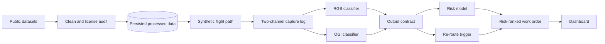

# Technical Requirements Document (TRD)
# Autonomous Drone Pipeline Inspection — Feasibility PoC
### *Companion to `Final_PRD.md` — derived from `Pipeline_Integrity_Timeline.xlsx`*

## Document Control

| Field | Value |
|---|---|
| **Project** | Autonomous Drone Pipeline Inspection PoC ("Pipeline Integrity Pilot") — Deloitte Energy & Chemicals |
| **Companion doc** | `Final_PRD.md` — product framing, stakeholders, timeline, risks |
| **Source material** | `Pipeline_Integrity_Timeline.xlsx` |
| **Scope of this document** | System architecture, data specifications, model specs, interfaces, and non-functional requirements needed to build the PoC |
| **Status** | **Rev. 4 (Final)** — revised Sept 7, 2026 (Week 1, Day 1) following an independent procedural review of Rev. 3. Rev. 2 closed *requirement* gaps; Rev. 3 closed *architecture* gaps; Rev. 4 closes the gap in *how the remaining human decisions get made* and adds a resourcing fallback the plan lacked. Changes marked **[Rev. 4]** inline, on top of the existing **[Rev. 3]**, **[Rev. 2]**, and **[Recommended]** conventions. See `Final_Change_Notes.md` for the Rev. 3 → Rev. 4 rationale, `Opus5_Change_Notes.md` for Rev. 2 → Rev. 3, and `Review_Memo.md` for Rev. 1 → Rev. 2. |
| **What Rev. 4 addresses** | Rev. 3 closed architecture gaps (ranking logic, contract, artifact handoff, persistence) but left the *process* for the still-open stakeholder decisions exactly as scattered as Rev. 2 did, and left the resourcing risk as the only major risk with no fallback. Rev. 4 fixes both, and adds one honesty note about the review chain that produced Rev. 2/3/4 itself. |

---

## 1. Architecture Overview

The four workstreams map directly onto the use case's own Sense → Reason → Act → Adapt loop:

| Loop stage | Track | Owner | System layer |
|---|---|---|---|
| Sense | Sensing & Simulation | Anshuman | Data + Simulation |
| Reason | Anomaly Detection Model | Shashwat | Model |
| Act | Flight Planning & Work Orders | Anshuman | Orchestration |
| Adapt | Integration, Dashboard & Demo | Shashwat | Integration + Reporting |



End-to-end data flow: public datasets → cleaning/license audit → **persisted processed store (§4.8)** → synthetic flight-path generator → mock two-channel drone capture log → [RGB classifier | OGI classifier] → shared output contract (§5) → flight re-route trigger + **risk model (§9.2)** → risk-ranked work order (§9) → dashboard view (§10).

> **[Rev. 2] "Adapt" is a label, not a loop.** As specified, nothing downstream of the dashboard feeds back into Sense — there's no retraining trigger and no patrol-strategy adjustment. The four-stage name is inherited from the use case's own framing; the PoC implements Sense→Reason→Act→**Report**. Fine for a PoC, but FR-2.4 (PRD) now asks Track 4 to say this explicitly in its Week 7 write-up rather than let "Adapt" imply more than what's built.

> **[Rev. 3] "Act" is a trigger, not a decision.** Rev. 2 conceded that Adapt isn't a loop; the same honesty applies one box earlier. Re-routing is a confidence threshold firing on anomalies injected at *known* waypoints, producing a scripted path change. It demonstrates that the wiring works. It is not autonomous decision-making, and no closed loop sits behind it. Of the four named stages, two (Reason, and the risk ranking within Act) contain real logic; the other two demonstrate integration. That is an entirely reasonable PoC — it just shouldn't be narrated as more.

> **[Rev. 3] Topology note — this is a chain with a single fan-in.** Both owners' work converges on the output contract (§5), and everything after it depends on that shape. There is no architectural redundancy: a late change to the contract costs both people rework at once. This is why the contract is frozen as code at end of Week 2 (PRD §9b) rather than left informally agreed. Freezing the interface early is the single highest-leverage schedule decision available to this project.

> **[Rev. 4] The review chain deserves the same honesty this document applies to the system.** Rev. 2 and Rev. 3 were each produced by a reviewer examining the revision before it; this document is a fourth such pass. None of the four substitutes for the human domain expert or the stakeholders named throughout PRD §6 and §9c. Where a section below says "recommended default" or "recommended band," read "default" literally — it is a starting position chosen to unblock Week 2/3 work, not a validated answer. The only thing that changes a recommended default into a confirmed one is the Week 1 sync (PRD §9c) actually happening.

## 2. Environment & Tooling

| Item | Spec | Source |
|---|---|---|
| Training compute | Google Colab; no local GPU assumed | Source plan |
| Shared tooling | Repo + dependency environment set up in Week 1, shared across both modalities | Source plan |
| Language/framework | Python; CNN transfer learning implies a framework such as PyTorch or TensorFlow | **[Recommended]** — not named in source |
| Version control | Git repository | **[Recommended]** — implied by "repo" in the Week 1 task, not spelled out |
| Notebook layout | One Colab notebook per track/classifier, sharing a common `data/` and `interfaces/` module | **[Recommended]** |
| **Persistent storage [Rev. 3]** | Google Drive, mounted into Colab, holding `data/processed/` and `models/*/artifacts/`. Colab's own disk is ephemeral and must not be the only copy of anything that takes more than a few minutes to regenerate | **[Rev. 3]** |
| **Contract module [Rev. 3]** | `models/interfaces.py` — validated schema objects (`pydantic`, or dataclasses plus an explicit validator), imported by every producer and consumer of a reading or work order | **[Rev. 3]** |

## 3. Data Sources & Specifications

All datasets below were verified by the source-plan authors (source-by-source, Sept 2026) **and independently re-checked against primary sources for this TRD** (papers, GitHub repos, dataset pages). Two discrepancies surfaced during that re-check — flagged inline and summarized in §3.4.

### 3.1 RGB Corrosion Imagery

| Dataset | Nature | Size | License / access | Link |
|---|---|---|---|---|
| Kaggle "Pipeline Corrosion Dataset" (aditya068) | Real photos of normal/corroded pipelines | 384.69 MB (confirmed) | **License field reads "Not specified" on the Kaggle page — treat as unresolved, see §15** | `kaggle.com/datasets/aditya068/pipeline-corrosion-dataset` |
| K-Pipelines (Ramos et al., *Intelligent Systems with Applications*, Elsevier) | Peer-reviewed, Stable-Diffusion-synthetic | 600 base images / 1,080 in the augmented version (confirmed) | GPL-3.0 (copyleft) | `github.com/leoxthomas/K-Pipelines` — pip-installable: `pip install git+https://github.com/leoxthomas/K-Pipelines` |
| Scraped GitHub corrosion set | Real, scraped from Google Images across 8 corrosion categories | Repo states **1,819** labeled images (CORROSION + NO CORROSION combined) — **see discrepancy note §3.4** | Noisy labels — needs cleaning (Week 2) | `github.com/pjsun2012/Phase5_Capstone-Project` |

> **[Rev. 2] Taxonomy note:** the scraped set's 8 corrosion categories create a real ambiguity the source plan doesn't resolve — is the RGB classifier binary or 8-class? OGI is explicitly binary (§7.2); RGB was left open. **Recommended default:** binary (`corrosion`/`no_corrosion`) for the Week 3 MVP, folding the 8 categories together; treat multi-class as a stretch extension once the binary baseline meets its floor (§7.4). **[Rev. 4]** Confirmed or adjusted at the Week 1 sync (PRD §9c), not left as a standing footnote through Week 3.

> **[Rev. 3] Composition warning.** These three sources are not interchangeable: one is real photography of unknown provenance, one is real but Google-Images-scraped with noisy labels, and one is **synthetically generated by Stable Diffusion**. Mixing them into a single training pool means the model may learn "is this a diffusion-generated image?" as a shortcut to the corrosion label, if the synthetic set skews toward one class. **Required:** record the per-source class breakdown in `DATASETS.md` before training, and keep the source of each image traceable so a source-wise performance breakdown is possible if results look surprising.

### 3.2 OGI / Methane Leak Imagery

| Dataset | Nature | Size | License / access | Link |
|---|---|---|---|---|
| GasVid (Wang et al., Stanford Natural Gas Initiative, METEC controlled releases, July 2017) | Real IR video, FLIR GF-320 camera, 31 videos × 24 min | Originating paper states **~669,600 frames**; several later papers cite "~1M" — **see discrepancy note §3.4** | Per source papers | Published via the VideoGasNet/GasNet paper family (no single canonical repo link recorded) |
| Gas-DB / RT-CAN | Real RGB-thermal pairs, 8 scene types (sunny, rainy, near/far leakage, overlook, simple/complex background) | 1,293 images (confirmed, ~1.3K) | Per source paper; data hosted via Google Drive/OneDrive links inside the repo, not bundled directly | `github.com/logic112358/RT-CAN` |
| GasSeg | Real-world infrared gas segmentation, largest of the three | 6,426 images / 7,390 segmentation targets (confirmed) | **Training data on request only — confirmed, not direct download** | `github.com/FisherYuuri/GasSeg` |

> **[Rev. 3] GasVid is one capture setup, not a diverse corpus.** All 31 videos come from a tripod-mounted FLIR GF-320 at the METEC controlled-release facility. The ~670K frames are numerous but not *varied* — they represent one camera, one site, one set of release conditions. A model trained here can reach a high held-out F1 by learning that specific setup. This is not a defect in the dataset (it is the best public OGI video available); it is a ceiling on what the resulting metric means, and §7.4 requires that ceiling to be stated wherever the metric is reported.

### 3.3 Optional / Out of Scope

| Dataset | Modality | Status |
|---|---|---|
| GPLA-12 (Deep-AI-Application-DAIP) | Acoustic emission | Confirmed: 684 samples across 12 categories, lab-bench-scale, now on its third data revision (`data_v1`/`data_v2`/current). **Optional bonus module only** — inclusion decided at Checkpoint 1. Links: `github.com/Deep-AI-Application-DAIP/acoustic-leakage-dataset-GPLA-12`, `daip.club` |
| — none identified — | LiDAR ground-movement/encroachment | **Out of scope** — confirmed no public dataset exists |

*(Aside: the source plan's comparison to "the IIG dataset" for access friction likely refers to the same GasSeg author's separate Industrial Invisible Gas dataset — not itself a candidate source for this PoC, just a data point on access difficulty.)*

### 3.4 Discrepancies Found During Independent Verification

Both worth resolving before locking Week 2–4 effort estimates — neither invalidates the plan, but both affect sizing assumptions:

1. **Scraped RGB corrosion set:** the source plan estimates ~4,000 images; the repository's own description states 1,819 labeled images (corrosion + no-corrosion combined). Recommend pulling the current repo contents directly in Week 1 to get an exact count before scoping the Week 2 cleaning pass.
2. **GasVid frame count:** the source plan's Overview tab notes a correction from "~700K" to "~1 million" frames. Independent re-verification found the opposite may be true: the originating VideoGasNet paper (Wang et al.) states **~669,600 frames** — a figure that reconciles exactly with its own stated parameters (31 videos × 24 min × 15 fps = 669,600). Several *later* papers that reuse GasVid instead cite "~1M" or "over a million," which appears to be citation drift rather than a corrected figure. Recommend verifying frame count directly from the dataset files in Week 1 rather than hardcoding either number.

> **[Rev. 3]** Note that the exact GasVid frame count barely matters for the model, because §4.9 requires training on a fixed sampled subset rather than all frames. It matters for *storage and decode time* planning. Resolve it, but don't let it block modeling.

## 4. Data Pipeline Requirements

| ID | Requirement | Week |
|---|---|---|
| TR-4.1 | License audit across every dataset actually used (K-Pipelines GPL-3.0 obligations, Kaggle's unspecified license flagged/quarantined until resolved, GasVid/Gas-DB per their papers) | 1 |
| TR-4.2 | Shared Python/ML tooling setup (Colab access, repo, dependency environment) for both modalities | 1 |
| TR-4.3 | Cleaning pass on the scraped RGB set — remove noisy/mislabeled images (re-count first, per §3.4) | 2 |
| TR-4.4 | Format standardization per modality (images/video frames → tensor-ready format) | **[Recommended]** — implied, not explicit |
| TR-4.5 | Simulated flight-log construction: attach RGB + OGI samples to synthetic flight waypoints/timestamps, producing the mock two-channel "drone capture log" | 2 |
| TR-4.6 **[Rev. 2]** | Train/held-out split methodology, defined per modality before any training starts: GasVid split **by video** (not by frame) to prevent near-duplicate frames leaking across the split; RGB sources split by image with stratification to preserve class balance | 1–2 |
| TR-4.7 **[Rev. 2]** | Class-balance check on each training set; if imbalanced (e.g. far more "no anomaly" than "anomaly" samples), apply stratified sampling or class weighting so accuracy alone doesn't mask a model that just predicts the majority class | 3 |
| TR-4.8 **[Rev. 3]** | **Persistent processed-data store.** `data/processed/` lives on mounted Google Drive and is the single source of truth for all training and simulation input. Written once by the Week-2 cleaning pass; read thereafter. Accompanied by a `manifest.json` recording per-source file counts, class breakdown, and the split assignment — so a later session can confirm it is using the same data, not silently re-derived data | 2 |
| TR-4.9 **[Rev. 3]** | **Fixed GasVid frame subset.** Extract a documented, seed-pinned subset (fixed stride per video) rather than decoding ~670K frames every session. Record the stride, seed, resulting frame count, and per-video assignment in the manifest. Re-decoding the full set each Colab session is a silent tax on a 4–6 hr/week budget and a reproducibility hazard | 2 |
| TR-4.10 **[Rev. 3]** | **Source traceability.** Every processed RGB image retains its originating source (Kaggle / K-Pipelines / scraped) as metadata, enabling a per-source performance breakdown if results look anomalous (§3.1 composition warning) | 2 |

> **[Rev. 2] TR-4.1 is a gate, not a checklist item.** Route K-Pipelines' GPL-3.0 status and the Kaggle set's unspecified license through Deloitte's OSS/legal review in Week 1 — this is a legal determination, not an engineering judgment call. **Go/no-go:** if the Kaggle license hasn't cleared by end of Week 1, drop it and proceed on K-Pipelines + the cleaned scraped set only, rather than let it silently block or slip into later weeks. Track this as an explicit line item in the Week 1 checklist (Appendix B). **[Rev. 4]** This is now one of *two* Week 1 go/no-go gates — see PRD §9d for the resourcing gate, which had been treated with less rigor than this one despite being the larger risk.

## 5. Classifier Output Contract

**TR-5.1** — This is the load-bearing interface of the whole system — agreeing it blocks Week 3 work in **both** tracks per the source plan. Every classifier (RGB corrosion, OGI/methane, and the optional acoustic bonus) must emit the same shape.

> **TR-5.2 [Rev. 2 — resolved, pending stakeholder confirmation]:** the class taxonomy is binary for the MVP — `corrosion` / `no_corrosion` for RGB, `leak` / `no_leak` for OGI (already specified this way in §7.2) — with severity-graded or multi-class labels (e.g. the scraped set's 8 corrosion categories) deferred to a stretch extension once each binary baseline clears its floor (§7.4).

### TR-5.3 — Widened contract **[Rev. 3]**

Rev. 2's contract was `{class, confidence, location}`. That shape cannot support the work order downstream of it: the work-order schema (§9) requires `source_classifier`, `anomaly_type`, and `urgency`, none of which the reading carries, forcing Track 2/4 to reconstruct provenance it was never given. `location` was also an untyped string ("waypoint_id_or_corridor_coordinate"), conflating two different things, and there was no timestamp — which both patrol ordering and any temporal OGI work (§7.2b) need.

```json
{
  "reading_id": "string",
  "waypoint_id": "string",
  "coordinate": { "lat": 0.0, "lon": 0.0 },
  "timestamp": "2026-10-14T09:31:07Z",
  "source_modality": "rgb_corrosion | ogi_methane | acoustic",
  "model_version": "string",
  "class": "corrosion | no_corrosion | leak | no_leak",
  "confidence": 0.0,
  "bbox": null
}
```

| Field | Why it's here |
|---|---|
| `reading_id` | Lets a work order point back at the exact reading that produced it — otherwise findings are untraceable in the dashboard |
| `waypoint_id` + `coordinate` | Separates "which stop on the route" from "where on Earth"; the old single string forced consumers to parse intent out of a string |
| `timestamp` | Required for patrol ordering, and by any temporal OGI feature (§7.2b) |
| `source_modality` | The classifier stamps its own provenance, so `source_classifier` in the work order is copied, never guessed |
| `model_version` | Ties a finding to the artifact that produced it (§8.5); makes a regression traceable |
| `class` + `confidence` | Unchanged from Rev. 2 |
| `bbox` | Optional, nullable. Present so adding localisation later is additive rather than a breaking change |

**Deliberately absent:** `urgency` and `recommended_action`. Those are *policy*, produced by the risk model (§9.2), not *observations* produced by a classifier. Keeping them out of the reading keeps the model layer free of business rules.

### TR-5.4 — The contract is code, not prose **[Rev. 3]**

The contract is defined once in `models/interfaces.py` as a validated object (`pydantic` model, or dataclass plus explicit validator) and imported by every producer and consumer. An invalid reading must raise at construction, not surface as a downstream bug three weeks later.

Rationale: two people building in parallel Colab notebooks against a JSON block in a Markdown file **will** diverge — on field names, on casing, on null handling — and won't discover it until integration week, which is also the tightest week in the schedule (§13a). Making the contract executable turns a coordination problem into an import.

### TR-5.5 — Freeze **[Rev. 3]**

Frozen at end of Week 2 per PRD §9b. Additive optional fields are always allowed; renames, removals, and type changes require both owners' agreement and a version bump on the module.

## 6. Simulation Environment Spec

| ID | Requirement | Week |
|---|---|---|
| TR-6.1 | Synthetic pipeline-corridor flight path (waypoints along a mock route), standing in for a real drone GPS track | 2 |
| TR-6.2 | Extend to multiple patrol routes + configurable anomaly-injection points for both sensor channels | 3 |
| TR-6.3 | Model each sensor modality's real-world noise/false-positive characteristics (IR vs RGB camera) for realistic injected noise — GasVid's own capture setup (tripod-mounted FLIR GF-320, 15 fps, grayscale) is a useful reference point for the IR side | 3 |
| TR-6.4 | Wire the simulator to trigger a sensor reading (either channel) at each waypoint, per the §5 contract | 4 |
| TR-6.5 | Visualize a simulated patrol run (map + readings, both channels) | 4 |
| TR-6.6 | **Demo:** simulated patrol run produces sensor readings from both channels along a synthetic corridor | 5 — **Checkpoint 1** |
| TR-6.7 **[Rev. 3]** | **Name the mechanism.** The simulator replays labeled dataset samples onto waypoints; it does not synthesise sensor output from a physical model. State this in the module docstring and the Week-7 write-up | 7 |

> **TR-6.2a [Rev. 2 — clarifies mechanism, not previously specified]:** "injecting an anomaly" means attaching a labeled-positive sample from the dataset to a waypoint at simulation time — there's no synthetic anomaly generation involved. **This must draw only from each classifier's held-out split, never its training split.** If a demo pulls injection samples from data the model was trained on, Checkpoint 1/Final will look better than the model actually is — this is the single easiest way this PoC could accidentally rig its own demo, so it's worth stating as a hard rule rather than an implementation detail left to whoever writes the injection code.

> **[Rev. 3] Why TR-6.7 matters.** Everything the "drone capture log" contains is a real photograph or IR frame that a human already labeled, selected by the simulator and stapled to a GPS waypoint. That is a legitimate and sensible PoC design — building a physically-accurate IR sensor model is far outside a 32–48 hour budget. The risk is purely narrative: a stakeholder watching a map animate with sensor readings appearing along a corridor may reasonably conclude the system is *sensing*. One accurate sentence in the write-up prevents a misunderstanding that would be much more costly to correct in Phase 2 planning.

## 7. Model Specifications

### 7.1 RGB Corrosion Classifier — TR-7.1
- **Approach:** transfer learning on a pretrained CNN. Backbone not specified in source — **[Recommended]** start with a standard, swappable choice (e.g. ResNet or EfficientNet). **[Rev. 2]** confirm the pretrained backbone's weight license and pin the exact framework/backbone version in `requirements.txt` for reproducibility.
- **Training data:** cleaned scraped set + Kaggle + K-Pipelines, subject to the §4 license audit.
- **Taxonomy:** binary for MVP per TR-5.2.
- **Schedule:** baseline built Week 3; trained/evaluated with accuracy/F1 documented Week 4.

> **TR-7.1a [Rev. 2]** Split by image, stratified to preserve the corrosion/no-corrosion ratio in both train and held-out sets, per TR-4.6.

> **TR-7.1b [Rev. 3]** Because the training pool mixes real and Stable-Diffusion-synthetic images (§3.1), report held-out F1 **broken down by source** as well as overall. If the model performs markedly better on K-Pipelines than on real photography, it has partly learned to recognise the generator, and the overall figure overstates real-world performance.

### 7.2 OGI / Methane Classifier — TR-7.2
- **Approach:** binary leak/no-leak classifier, baseline on GasVid.
- **Schedule:** baseline built Week 3; trained/evaluated with accuracy/F1 documented Week 4.
- **Stretch (optional, must not slip Checkpoint 1):** extend with Gas-DB segmentation masks, or incorporate GasSeg if access has arrived by Week 4. *(Reference point: GasSeg's own paper reports 90.68% mIoU / 95.02% mF1 — useful as a benchmark, not a target this PoC is expected to hit.)*

> **TR-7.2a [Rev. 2]** Split **by video**, not by frame, per TR-4.6 — GasVid's 31 videos each contribute thousands of near-duplicate frames, so a random frame-level split would put visually near-identical frames on both sides of the split and inflate the reported score. Held-out videos should be excluded from training entirely, not just their sampled frames.

> **TR-7.2b [Rev. 3] — Temporal signal (stretch).** A methane plume is a *temporal* object: it moves, billows and dissipates, and that motion is the primary cue a human OGI operator uses. Classifying independent still frames discards it, which caps achievable OGI performance and makes the "leak" class harder than it needs to be — a single faint grayscale IR frame is genuinely ambiguous.
> **Recommended (only if the frame baseline underperforms and time allows):** compute a frame difference against a short rolling median background and supply it as an additional input channel. This is a preprocessing change, not an architecture change — it keeps the same CNN and the same contract.
> **If not attempted:** say so in the Week-7 write-up. A modest OGI F1 should be read as a consequence of frame-wise modeling, not as a failed model.

> **TR-7.2c [Rev. 3] — Cross-setup sanity check (recommended).** If Gas-DB is used at all, prefer holding it **entirely out of training** and using it as a small cross-setup test rather than folding it into the training pool. 1,293 extra training images barely move a model; a second, independent capture setup is the only evidence available in this PoC about whether the OGI classifier generalises past its single rig. **Expect degradation** — the point is to measure and report it, not to tune against it. Never tune hyperparameters on this set; that would convert the only independent check into another validation set.

### 7.3 Acoustic Bonus Module (optional) — TR-7.3
- GPLA-12 dataset, 684 samples across 12 categories, lab-bench-scale.
- Inclusion decision made at the Checkpoint 1 review (Week 5); documented either way in the Week 7 "Adapt loop" write-up.

### 7.4 Evaluation — TR-7.4
- **Metric:** accuracy + F1 on held-out data, both classifiers, Week 4.
- **[Rev. 2 — recommended default, pending stakeholder confirmation]** Minimum bar: each classifier must beat a majority-class baseline and reach F1 ≥ 0.65 on its held-out split (matches PRD §5). Report both the metric and the baseline comparison together — an accuracy number alone can look fine on an imbalanced dataset even when the model isn't distinguishing classes (see TR-4.7).
- **[Rev. 2]** Demo/injection samples used at Checkpoint 1 and Final must come from the held-out split (TR-6.2a) — evaluation and demo must draw from the same non-training pool.
- **[Rev. 3] Scope every reported figure.** Each accuracy/F1 number is presented with the capture setup it was measured on — e.g. *"F1 0.81 on held-out GasVid videos (single FLIR GF-320, METEC facility)"* rather than *"F1 0.81."* An unscoped number will be read as a general capability claim. This costs one clause per figure and is the cheapest credibility protection available to this project.
- **[Rev. 3] Record the floor.** Write each classifier's achieved held-out F1 into its artifact's `metrics.json` (§8.5). The smoke test asserts against that recorded value so a later regression fails loudly (§14).

### 7.5 Confidence Comparability — TR-7.5 **[Rev. 3]**

**The problem.** The RGB and OGI classifiers are separately-trained networks on unrelated datasets. Neural network softmax outputs are systematically overconfident, and each model is miscalibrated *differently*. A `0.80` from the RGB model and a `0.80` from the OGI model are not the same quantity and do not represent the same likelihood of being correct. Rev. 2 nonetheless specified a single combined work order — and the only sortable numeric field was `confidence`. Ranking by it would produce a near-arbitrary order in the one artifact stakeholders look at most closely.

**Resolution — structural, not statistical.** Ranking is anchored to **modality-level urgency bands** (§9.2) and confidence is used only to sort *within* a band, comparing a model against itself. No ordering decision ever compares a raw score from one model against a raw score from the other.

This is deliberately the cheap fix. It costs nothing, it removes the invalid comparison entirely rather than trying to make it valid, and it encodes a real domain judgement (a methane leak and a patch of corrosion are not the same kind of event, and shouldn't be interleaved by a number that happens to be larger).

**Optional refinement, only if time allows:** temperature-scale each model on its held-out split so its stated confidence better matches its observed accuracy. This improves the *within-band* ordering and makes the confidence column more honest in the dashboard. It is a genuine improvement, not a prerequisite — the band structure above is what makes the ranking defensible.

## 8. Integration Architecture

| ID | Requirement | Week |
|---|---|---|
| TR-8.1 | Package both classifiers as callable functions/services behind one clean shared interface | 6 |
| TR-8.2 | Start wiring simulated capture → both classifiers into a single script | 6 |
| TR-8.3 | Flight re-routing logic: given a flagged anomaly from either classifier, simulate diverting for a closer look | 6 |
| TR-8.4 | Finish end-to-end wiring: capture → classifiers → re-route trigger → work order, as one runnable pipeline | 7 |
| TR-8.5 **[Rev. 3]** | **Model-artifact handoff convention** — see below. Decided Week 1, used from Week 3 | 1 (decide) / 3 (use) |

> **[Recommended]** implement both classifiers as local Python callables/classes behind a shared interface for this PoC. A networked service layer (e.g. FastAPI) is unnecessary at this scale unless the dashboard specifically needs to call them remotely — the source plan describes "callable functions/services," which is compatible with either, but the simpler option fits the ~4–6 hr/week budget better.

### TR-8.5 — Model-artifact handoff **[Rev. 3]**

**The gap.** Track 3 trains in Colab, where storage is ephemeral and sessions time out. Track 4 must load those models in Week 6. Rev. 2 said "package both classifiers as callable functions" but never specified how weights travel between the two — no format, no location, no version. In practice Week 6 would open with *"can you re-run your notebook and send me the weights?"*, which is exactly the wrong thing to be doing in the second-tightest week of the schedule. The gap is invisible in the plan because each track looks self-contained; it only exists in the space *between* them.

**Convention** — a versioned directory on mounted Drive, mirrored to a fixed repo-relative path:

```
models/<classifier_name>/artifacts/<version>/
├── weights.pt        # or framework equivalent
├── config.json       # backbone, input size, preprocessing, class order
├── metrics.json      # held-out accuracy, F1, majority baseline, split manifest hash
└── VERSION           # the string stamped into every reading's model_version
```

Rules:

1. **Class order lives in `config.json`.** A silently reordered class list is one of the easiest ways to ship an inverted classifier that still scores plausibly.
2. **Preprocessing lives with the weights.** Resize, normalisation and channel order must travel with the model — a mismatch here degrades accuracy quietly rather than raising an error.
3. **`VERSION` is stamped into every reading** via `model_version` (§5.3), so any finding can be traced to the exact artifact that produced it.
4. **Track 4 loads only through the shared interface**, never by importing training-notebook code.
5. **`metrics.json` records the F1 floor** the smoke test asserts against (§14).

The whole convention is a one-paragraph decision. Made in Week 1 it costs nothing; deferred to Week 6 it costs a week of the wrong kind of work.

## 9. Work Order Schema

**TR-9.1** — Drafted Week 6; generated as a full report Week 7, combining both classifiers' findings, risk-ranked. Fields per the source plan: location, anomaly type, source classifier, confidence, urgency, recommended action.

```json
{
  "work_order_id": "string",
  "reading_id": "string",
  "location": { "waypoint_id": "string", "coordinate": { "lat": 0.0, "lon": 0.0 } },
  "anomaly_type": "string",
  "source_classifier": "rgb_corrosion | ogi_methane | acoustic",
  "model_version": "string",
  "confidence": 0.0,
  "urgency": "low | medium | high",
  "recommended_action": "string",
  "rank": 0
}
```

**[Rev. 3] Changes from Rev. 2:** added `reading_id` and `model_version` (traceability back to the producing reading and artifact), structured `location` to match TR-5.3, and added explicit `rank` so the ordering is a recorded property of the report rather than an incidental property of list order.

### TR-9.2 — The risk model **[Rev. 3]**

Rev. 2 declared `urgency: low | medium | high` but specified no rule producing it, and left `anomaly_type` a free string with no mapping from classifier `class`. The single most demo-visible output of the system therefore had no logic behind it, and would have been invented under time pressure in Week 6 by whoever wrote `work_order.py` first.

**Rule — a readable table, not a clever function:**

| Source modality | Class | Confidence | Urgency | `anomaly_type` | `recommended_action` (illustrative) |
|---|---|---|---|---|---|
| `ogi_methane` | `leak` | ≥ 0.90 | **high** | `methane_leak` | Dispatch field crew within 24h; verify and isolate segment |
| `ogi_methane` | `leak` | 0.70 – 0.90 | **medium** | `methane_leak` | Schedule ground verification within 7 days |
| `ogi_methane` | `leak` | < 0.70 | **low** | `methane_leak_suspected` | Flag for re-inspection on next scheduled patrol |
| `rgb_corrosion` | `corrosion` | ≥ 0.90 | **medium** | `external_corrosion` | Schedule coating inspection within 30 days |
| `rgb_corrosion` | `corrosion` | 0.70 – 0.90 | **low** | `external_corrosion` | Log for trend tracking; review at next inspection cycle |
| `rgb_corrosion` | `corrosion` | < 0.70 | **low** | `external_corrosion_suspected` | Log only; no dispatch |
| any | `no_corrosion` / `no_leak` | any | — | — | **No work order generated** |

**Sort key:** `(urgency DESC, modality_priority DESC, confidence DESC)` where `modality_priority` is `ogi_methane > rgb_corrosion > acoustic`. Note that `confidence` is only ever compared *within* a single `(urgency, modality)` group — that is, a model against itself — which is what keeps the ordering free of the invalid cross-model comparison described in §7.5.

> **[Rev. 3] Open sub-decision — minimum reporting threshold.** The table above generates a work order for *every* positive prediction, including marginal ones. For a binary classifier a `leak` call at confidence 0.51 is close to a coin flip, and reporting all of them will pad the work order with noise that makes the ranked list look worse than the model is. **Recommended default:** suppress work orders below a floor (start at 0.50 — i.e. report all positives — and raise it if the Week 4 evaluation shows a long tail of marginal positives). Decide this *with* the band cut-offs in Week 3, and record whatever is chosen in `risk_model.py` next to the table, so the report's completeness is a stated policy rather than an accident of implementation.

**The domain judgement encoded here** — and the reason PRD §6 assumption 9 asks stakeholders to confirm it — is that **a methane leak outranks corrosion at equal confidence**. A leak is an acute safety, loss-of-product and emissions event on a timescale of hours to days; external corrosion is a degradation signal on a timescale of weeks to months. This is why no OGI band maps below `low` while a high-confidence corrosion finding tops out at `medium`.

> **[Rev. 4] This table is a recommended default, not a finding.** It is internally consistent and defensible on the stated reasoning, but no document revision — including this one — can confirm it is the *right* default without the domain sign-off PRD §9c exists to obtain. Treat everything in this table as provisional until that conversation happens, however reasonable it reads on the page.

Note what this structure achieves: because urgency is assigned per modality *before* sorting, the ranking never compares an RGB confidence against an OGI confidence. TR-7.5's problem is resolved by the shape of the rule rather than by statistics.

**Implementation:** one table or dict in `integration/risk_model.py`, imported by the work-order builder. Changing ranking policy means editing that one place — not hunting for `if confidence > 0.9` scattered through the codebase.

> **[Rev. 3] On `recommended_action` strings.** These read as operational guidance and will be the most authoritative-looking text in the whole demo. They are plausible integrity-management language written by the engineering team, **not** client-approved procedure. Label them illustrative in the write-up, and see PRD §6 assumption 10.

## 10. Dashboard / Reporting Requirements

**TR-10.1** — Week 7: a minimal report/dashboard view showing findings from both classifiers. Not specified further in the source plan. **[Recommended]** the simplest thing that shows the work-order list sorted by urgency/risk — a static HTML table, notebook output, or a lightweight Streamlit app — scaled to the part-time budget rather than a production dashboard.

> **TR-10.2 [Rev. 3]** Display `urgency` and `source_modality` as primary columns, with `confidence` secondary and clearly scoped to its own model. A table sorted by a bare confidence column invites precisely the cross-model comparison §7.5 exists to prevent — the display should reinforce the risk model, not undercut it.

> **TR-10.3 [Rev. 3]** If Weeks 6–7 run short, cut dashboard polish before cutting the risk model (PRD §9a). A plain, correctly-ranked table demonstrates the product thesis; a polished view over an arbitrary ordering does not.

## 11. Non-Functional Requirements

| Requirement | Detail |
|---|---|
| Compute constraints | Must run within Google Colab limits (session timeouts, ephemeral storage, variable GPU tiers) — no local GPU assumed |
| Time-boxing | Favor the simplest workable implementation over exhaustive engineering, given the ~4–6 hrs/week/person part-time cadence |
| Licensing compliance | Respect K-Pipelines' GPL-3.0 terms; do not ship anything built on the unresolved-license Kaggle set until resolved. **[Rev. 2]** Route both through Deloitte's OSS/legal review in Week 1 (TR-4.1) — a legal gate with a defined fallback, not an engineering checklist item |
| Reproducibility | Shared repo + documented dependency environment (Week 1). **[Rev. 2]** Pin exact framework and backbone versions, and record the pretrained backbone's license in `DATASETS.md`. **[Rev. 3]** Processed data and model artifacts persist on Drive with manifests (TR-4.8, TR-8.5), so a result can be reproduced without re-deriving inputs from scratch |
| Data privacy | No client data, no PII — all datasets are public research data |
| **Interface stability [Rev. 3]** | The shared contract is frozen at end of Week 2 and changes only by version bump (TR-5.5, PRD §9b) |
| **Claim discipline [Rev. 3]** | No performance figure is presented without its capture-setup scope (TR-7.4); no demo narration describes the simulator as sensing (TR-6.7) or the re-route as autonomous decision-making (§1) |
| **Pattern discipline [Rev. 4]** | The conventions Rev. 3 introduced — the validated contract (TR-5.4), versioned artifacts (TR-8.5), the persistence manifest (TR-4.8), the risk-model table (TR-9.2), and the two smoke-test assertions (§14) — are a ceiling for this PoC, not a floor. No further validation layer, metadata field, or test assertion is added without the same one-paragraph decision this document uses for its own additions. The budget that justified doing these five things does not automatically stretch to a sixth |
| **Decision hygiene [Rev. 4]** | Every "needs stakeholder confirmation" item in PRD §6 is resolved, adjusted, or explicitly re-dated at the Week 1 sync (PRD §9c) — not carried silently into the week that depends on it |

## 12. Suggested Repository Structure

**[Recommended — not specified in source; proposed to give Claude Code a concrete scaffold.]**

```
pipeline-integrity-poc/
├── README.md
├── docs/
│   ├── Final_PRD.md
│   ├── Final_TRD.md
│   └── Final_Change_Notes.md
├── data/
│   ├── raw/                  # untouched downloads per §3
│   ├── processed/            # cleaned/standardized — Drive-mounted, TR-4.8
│   ├── manifest.json         # counts, class breakdown, split assignment
│   └── DATASETS.md           # source links, licenses, verified counts, backbone license
├── simulation/
│   ├── flight_path.py        # TR-6.1, TR-6.2
│   ├── anomaly_injection.py  # TR-6.3, TR-6.2a
│   └── visualize.py          # TR-6.5
├── models/
│   ├── interfaces.py         # §5 contract as validated code
│   ├── rgb_corrosion/
│   │   ├── train.py
│   │   ├── predict.py        # shared-interface wrapper
│   │   └── artifacts/<ver>/  # weights, config, metrics, VERSION
│   ├── ogi_methane/
│   │   ├── train.py
│   │   ├── predict.py
│   │   └── artifacts/<ver>/
│   └── acoustic_bonus/       # optional, Track 3.5
├── integration/
│   ├── classifier_service.py # TR-8.1
│   ├── flight_reroute.py     # TR-8.3
│   ├── risk_model.py         # §9.2 band table
│   ├── work_order.py         # §9 schema
│   └── pipeline.py           # TR-8.4, one runnable entrypoint
├── dashboard/
│   └── report_view.py        # §10
├── notebooks/                 # Colab-facing training notebooks
└── tests/
    └── test_e2e_smoke.py      # §14
```

## 13. Milestone → Technical Deliverable Mapping

**Checkpoint 1 (Week 5):**
- Simulator produces two-channel readings along a synthetic corridor (TR-6.6)
- Both classifiers trained, evaluated, and flagging injected anomalies with accuracy/F1 reported against the held-out split (§7.4), each beating its majority-class baseline; injected samples drawn from held-out data only (TR-6.2a)
- **[Rev. 3]** Both classifiers published as loadable versioned artifacts (TR-8.5); every reported figure scoped to its capture setup (TR-7.4)
- Stakeholder review confirms Weeks 6–8 scope, including the acoustic bonus decision

**Checkpoint 2 / Final Submission (Week 8):**
- Full pipeline runs end to end: capture → dual classification → re-route trigger → risk-ranked work order → dashboard (TR-8.4, §9, §10)
- **[Rev. 3]** Work-order ordering matches the documented risk model, asserted in the smoke test (§14)
- Limitations documented (public-data training, single-capture-setup ceiling, simulator-as-replayer, Act/Adapt honesty, any unintegrated GasSeg/acoustic, LiDAR exclusion)
- One-page Phase 2 roadmap for leadership

## 13a. Feasibility Check: Hour Budget **[Rev. 2 — recommended]**

At ~4–6 hrs/week/person over 8 weeks, that's roughly 32–48 hours *each* — worth a rough gut-check, not a formal estimate:

| Week | Tightest load | Why |
|---|---|---|
| 1 | Both | Six source-plan tasks (acquire + vet two dataset families, license-audit multiple sources, request GasSeg access, stand up shared tooling) compressed into the first 4–6 hour window, before any modeling work starts. **[Rev. 3]** Plus two one-paragraph decisions (artifact handoff, data persistence) — small, but they must not slip. **[Rev. 4]** Plus the consolidated decision sync (PRD §9c) — one 30–45 min conversation, timed deliberately after tooling setup so it doesn't compete with it |
| 3 | Shashwat | Two baseline classifiers built the same week the output contract (TR-5.1/5.3) needs to be settled — a slip in that decision pushes both. **[Rev. 3]** Mitigated: the contract is frozen at end of Week 2, so Week 3 starts against a fixed interface |
| 6–7 | Both | Anshuman's work-order format and Shashwat's integration/dashboard converge in the same two weeks — the shared schema (§9) is the coordination point. **[Rev. 3]** Substantially de-risked: the contract is frozen (TR-5.5), the risk model is decided (§9.2), and artifacts are already loadable (TR-8.5), so Weeks 6–7 become assembly rather than negotiation |

> **[Rev. 4] If the resourcing gate (PRD §9d) triggers,** re-read this table against the lower capacity bound (~8–12 hrs/week combined, not ~4–6 hrs/week/person) at the Week 1 review — Week 1 and Weeks 6–7 are named here as the tightest points *at full capacity*; they get tighter first if capacity is actually halved.

## 14. Testing & Validation Approach

**[Recommended — not specified in source; scaled to an 8-week, 2-person, part-time PoC.]**

- **Unit-level:** verify each classifier's output conforms to the §5 contract. **[Rev. 3]** Now largely automatic — the contract object validates on construction (TR-5.4).
- **Integration-level:** one scripted end-to-end run (capture → classifiers → re-route → work order → dashboard) as a smoke test, re-run at each checkpoint.
- **Model validation:** held-out accuracy/F1, tracked per §7.4, verified against the majority-class baseline (not accuracy alone).
- **[Rev. 2] Split validation:** before training, spot-check that no video appears in both GasVid's train and held-out sets (TR-7.2a), and that injection samples used in any demo are drawn from the held-out pool, not training (TR-6.2a).
- **[Rev. 2] Week 1 go/no-go gate:** license audit (TR-4.1) explicitly signed off — or its fallback triggered — before any dataset is used for training. **[Rev. 4]** Now one of two Week 1 go/no-go gates tracked at this level of rigor — see PRD §9d for the resourcing gate.
- **[Rev. 3] Ranking assertion:** a fixed fixture set of readings, spanning both modalities and several confidence bands, must produce a work order in the order the risk model (§9.2) specifies. This is the only automated check on the system's headline output; without it, a ranking bug passes the smoke test silently and is discovered on stage.
- **[Rev. 3] Model regression assertion:** each classifier's held-out F1 must not fall below the floor recorded in its artifact's `metrics.json` (TR-8.5). Catches an accidentally-retrained or wrongly-loaded model — including a mismatched class order, which otherwise fails silently.
- A full CI/CD suite is disproportionate at this scale — a single `run_e2e_demo.py` smoke-test script is recommended, with the two Rev. 3 assertions added to it rather than a new framework introduced. **[Rev. 4]** No third assertion gets added without the same reasoning §11's "Pattern discipline" row asks for elsewhere — this script's job is to catch the two failure modes named above, not to grow into a general test suite.

## 15. Technical Risks

- **Dataset license conflicts** — Kaggle's license is unspecified; K-Pipelines is GPL-3.0 (copyleft). **[Rev. 2]** Treat as a legal-review item (TR-4.1), not an engineering compatibility check.
- GasSeg / acoustic dependencies arriving late or not at all — both already treated as non-blocking in the source plan.
- Noisy labels in the scraped RGB set — the Week 2 cleaning pass is real, non-trivial work, not a formality, and its actual size should be re-confirmed (§3.4).
- Colab session/storage limits could interrupt training runs on the larger datasets. **[Rev. 3]** Mitigated by persisted processed data (TR-4.8) and a fixed frame subset (TR-4.9).
- **[Rev. 2] Train/test leakage** — a frame-level split on GasVid, or reusing training samples for demo injection, would make both the reported metrics and the live demo look better than the underlying model actually is (TR-7.2a, TR-6.2a).
- **[Rev. 2] Class imbalance** — real-world leak/corrosion datasets typically skew toward "no anomaly"; accuracy alone can be misleading on a skewed set (TR-4.7, TR-7.4).
- **[Rev. 3] Cross-model confidence incomparability** — two separately-miscalibrated models cannot be ranked against each other by raw score. Resolved structurally by §7.5 / §9.2; would otherwise produce an arbitrary order in the most-scrutinised artifact.
- **[Rev. 3] Single-capture-setup generalization ceiling** — GasVid is one camera at one facility; K-Pipelines is diffusion-synthetic. A strong held-out F1 may reflect the rig or the generator (§3.2, TR-7.1b). Not solvable within this data budget; mitigated by scoped reporting (TR-7.4) and the optional Gas-DB cross-setup check (TR-7.2c).
- **[Rev. 3] Undefined model handoff** — without TR-8.5, Week 6 integration starts by re-running notebooks. Highest-probability schedule risk in the plan, and the cheapest to remove.
- **[Rev. 3] Interface drift** — two people, two notebooks, one prose spec. Resolved by TR-5.4 (contract as importable code) and the Week-2 freeze.
- **[Rev. 3] Synthetic/real shortcut learning** — if K-Pipelines' synthetic images skew toward one class, the RGB model may learn "diffusion-generated?" instead of "corroded?" (§3.1). Detected by the per-source breakdown in TR-7.1b.
- **[Rev. 4] Unconfirmed defaults reaching Week 3/6 as if they were decisions** — six items (PRD §6) have carried a recommended default across two revisions with no recorded stakeholder answer. Mitigated by the Week 1 sync (PRD §9c), which forces a recorded outcome rather than a silent default.
- **[Rev. 4] Resourcing risk with no fallback** — the largest unquantified risk in the plan had no defined behavior if it went unanswered, unlike every other Week 1 risk. Mitigated by the resourcing gate (PRD §9d).
- No real-world (client pipeline) validation — a scope limitation to state plainly in the Week 8 write-up, not a defect to fix within this PoC.

## 16. Out of Scope (Technical)

- LiDAR-based detection (no public dataset exists).
- Any real drone hardware, firmware, or flight-controller integration.
- Production-grade deployment: auth, scaling, monitoring, CI/CD.
- Training or validating on the client's proprietary pipeline data.
- **[Rev. 3]** Physically-simulated sensor synthesis — the simulator replays labeled samples (TR-6.7).
- **[Rev. 3]** Any claim of cross-camera or cross-site generalization (PRD §4).
- **[Rev. 4]** Any validation, metadata, or test layer beyond §5, §8.5, §9.2, and §14 as written, unless it goes through the one-paragraph decision process in §11 ("Pattern discipline").

---

## Appendix A: Full Dataset Source Links

- Kaggle "Pipeline Corrosion Dataset" (aditya068) — `kaggle.com/datasets/aditya068/pipeline-corrosion-dataset`
- K-Pipelines (Ramos et al., Elsevier) — `github.com/leoxthomas/K-Pipelines`
- Scraped corrosion set (pjsun2012) — `github.com/pjsun2012/Phase5_Capstone-Project`
- GasVid / VideoGasNet / GasNet (Stanford Natural Gas Initiative, METEC) — paper family, no single canonical repo
- Gas-DB / RT-CAN — `github.com/logic112358/RT-CAN`
- GasSeg — `github.com/FisherYuuri/GasSeg`
- GPLA-12 acoustic leak dataset — `github.com/Deep-AI-Application-DAIP/acoustic-leakage-dataset-GPLA-12`, `daip.club`

## Appendix B: Week-by-Week Technical Checklist

| Week | Key technical output |
|---|---|
| 1 | Datasets downloaded/vetted (counts re-confirmed per §3.4); licenses checked; shared tooling set up. **[Rev. 2] Go/no-go:** license audit (TR-4.1) signed off or fallback triggered before Week 2 work begins. **[Rev. 3]** Artifact-handoff convention (TR-8.5) and persistence location (TR-4.8) written down. **[Rev. 4]** Consolidated decision sync held (PRD §9c) — all six items in that table get a recorded outcome; resourcing gate (PRD §9d) triggered if item 2 is unconfirmed |
| 2 | Flight-path simulator built; RGB set cleaned and persisted with manifest (TR-4.8, TR-4.10); GasVid subset extracted (TR-4.9); **contract frozen as code (TR-5.4, TR-5.5)** |
| 3 | Simulator extended (multi-route + injection); both baseline classifiers built; **risk model table decided (§9.2)** — should already be confirmed from the Week 1 sync |
| 4 | Simulator wired + visualized; both classifiers trained/evaluated; artifacts published with `metrics.json` (TR-8.5); per-source breakdown reported (TR-7.1b) |
| 5 | **Checkpoint 1** — full sensing-side demo, both classifiers flagging anomalies, figures scoped to capture setup |
| 6 | Flight re-routing logic; work-order format drafted; classifiers loaded from artifacts via shared interface |
| 7 | Full work-order report generated; end-to-end wiring complete; minimal dashboard; ranking + F1-floor assertions in the smoke test (§14) |
| 8 | **Final** — full E2E PoC demo; limitations (including honesty items from §1, §6.7) + Phase 2 roadmap documented |

## Appendix C: Still Open After Four Revisions **[Rev. 4]**

Four revisions of these two documents have not answered the following — and a fifth wouldn't either, because none of them are architecture or requirements questions. They are named here so "Final" is read as "the document is done," not "the plan has no open questions left."

| # | Item | Only closed by | Tracked in |
|---|---|---|---|
| 1 | Resourcing conflict (parallel LeRobot commitment) | Project owner's actual answer | PRD §9c, §9d |
| 2 | Minimum quality bar (F1 ≥ 0.65?) | Stakeholder sign-off | PRD §6 item 7, §9c |
| 3 | RGB taxonomy (binary vs. multi-class) | Stakeholder sign-off | PRD §6 item 8, §9c |
| 4 | Risk-model bands (does a leak really outrank corrosion here?) | Stakeholder / domain sign-off | TRD §9.2, PRD §9c |
| 5 | `recommended_action` wording | Domain authority supplying real language, or confirming "illustrative" is fine | PRD §6 item 10, §9c |
| 6 | License audit outcome for the Kaggle set | Deloitte OSS/legal review | TRD TR-4.1 |

If all six are answered at the Week 1 sync (PRD §9c) and the license/resourcing gates (TR-4.1, PRD §9d) clear, this document set has done everything a document can do. What happens from Week 3 onward is a build, not a review.

---

## Appendix D: Revision History

| Revision | Date | Nature | Record |
|---|---|---|---|
| Rev. 1 | — | Derived directly from `Pipeline_Integrity_Timeline.xlsx` | — |
| Rev. 2 | Sept 3, 2026 | Requirements review — closed leakage, taxonomy, licensing-as-legal-question, and no-quality-bar gaps | `Review_Memo.md` |
| Rev. 3 | Sept 7, 2026 | Architecture review — defined the risk model, widened and froze the contract, defined model-artifact handoff and data persistence, extended the honesty pass, added two smoke-test assertions | `Opus5_Change_Notes.md` |
| Rev. 4 (Final) | Sept 7, 2026 | Procedural review — consolidated the six still-open stakeholder decisions into one Week 1 sync, gave the resourcing risk a fallback, added a pattern-discipline guardrail against over-extending Rev. 3's new rigor, and named the review chain's own limits | `Final_Change_Notes.md` |
